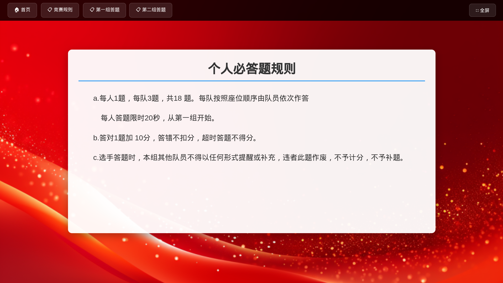
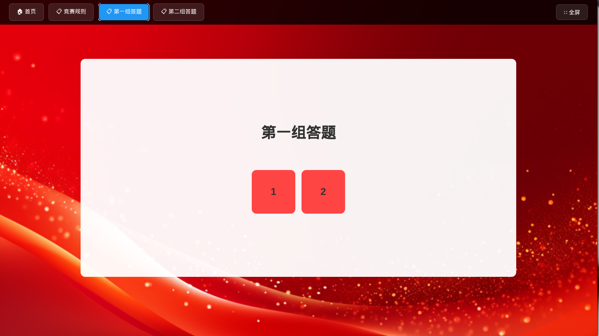
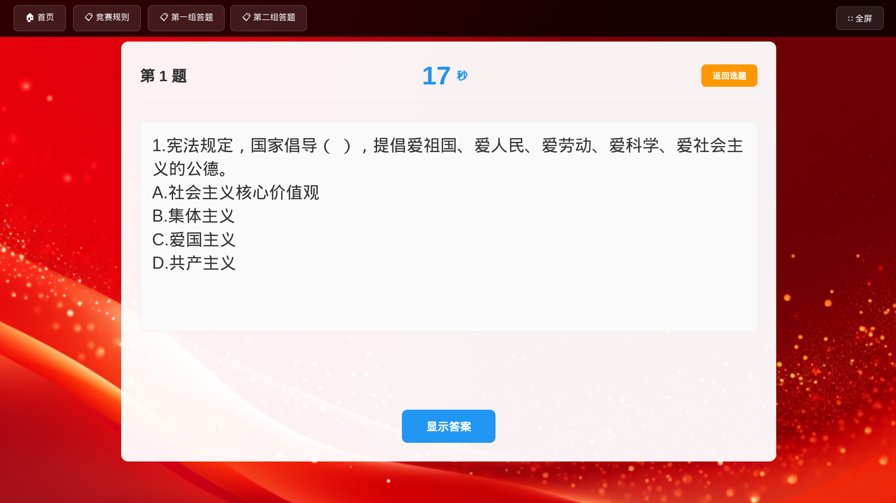

# 知识竞赛静态PPT系统

一个纯静态的网页应用，用于在浏览器中直接运行知识竞赛活动，无需服务器环境。








## 功能特点

- 🚀 **纯静态部署**：无需服务器，直接在浏览器中打开HTML文件
- 📝 **简单配置**：通过JavaScript文件管理题目和样式
- 🎨 **自定义主题**：支持背景图、颜色主题、倒计时等设置
- 📱 **响应式设计**：支持桌面和移动设备
- 🔄 **页面导航**：首页、选题页、题目页的无缝切换
- ⏱️ **倒计时功能**：自定义倒计时时长，颜色警告提示
- 📊 **进度追踪**：实时显示已答题数量和总题数
- 🖼️ **全屏模式**：支持F11快捷键和按钮切换

## 当前实现状态

### 已实现功能 ✅

1. **基础页面系统**
   - 首页：点击进入选题页
   - 选题页：10x12题目网格，每行10题，垂直居中
   - 题目页：显示题目、倒计时、答案控制

2. **交互功能**
   - 题目跳转：点击选题页的题目按钮进入对应题目
   - 倒计时：可配置时长，时间到停止但不自动显示答案
   - 答案显示：手动点击"显示答案"按钮查看答案
   - 导航控制：首页、选题页、全屏切换按钮

3. **视觉设计**
   - 50%透明度背景
   - 未选题目：红色背景+白色文字（正常大小）
   - 已选题目：灰色20%透明+缩小到80%
   - 当前题目：蓝色高亮（仅在题目页）
   - 响应式布局：桌面10题/行，平板7题/行，手机5题/行

4. **配置系统**
   - 外部配置文件：`simple-config.js`
   - 统一标题：所有页面使用相同的配置标题
   - 题目管理：JSON格式，支持id、question、answer字段
   - 样式定制：支持颜色、背景、计时时长等设置

5. **倒计时修复**
   - 修复了"30秒"停留2秒的bug
   - 准确的1秒间隔倒计时
   - 颜色警告：≤10秒橙色，≤5秒红色

## 快速开始

### 1. 直接使用
```bash
# 克隆或下载文件
git clone <repository-url>
cd knowledge-quiz-ppt

# 在浏览器中打开
open index.html
# 或者
python3 -m http.server 8000
# 访问 http://localhost:8000
```

### 2. 自定义配置
编辑 `simple-config.js` 文件：

```javascript
const QUIZ_CONFIG = {
    title: "我的知识竞赛",        // 修改标题

    styles: {
        textColor: "#ffffff",      // 文字颜色
        primaryColor: "#2196F3",  // 主要颜色
        background: "background.png" // 背景图片
    },

    timerDuration: 30,            // 倒计时秒数

    questions: [
        {
            id: 1,
            question: "你的问题？",
            answer: "答案"
        },
        // 添加更多题目...
    ]
};
```

## 配置说明

### 基础配置
- `title`: 竞赛标题，所有页面统一显示
- `timerDuration`: 倒计时秒数（默认30秒）
- `enableSoundEffects`: 音效开关（未启用）
- `autoProgress`: 自动进度（未启用）
- `shuffleQuestions`: 随机题目（未启用）

### 样式配置
- `textColor`: 文字颜色
- `primaryColor`: 主要颜色（蓝色系）
- `successColor`: 成功颜色（绿色系）
- `warningColor`: 警告颜色（橙色系）
- `dangerColor`: 危险颜色（红色系）
- `background`: 背景图片路径

### 题目格式
```javascript
{
    id: 1,                              // 题目编号（必需）
    question: "问题内容？",              // 题目文本（必需）
    answer: "答案内容"                   // 答案文本（必需）
}
```

## 使用场景

- 🎓 **教育培训**：课堂知识竞赛、学生测试
- 🏢 **企业活动**：团建活动、员工培训
- 🎮 **娱乐活动**：朋友聚会、家庭娱乐
- 📚 **个人学习**：知识复习、自我测试

## 技术特点

### 前端技术栈
- **HTML5**: 语义化页面结构
- **CSS3**: 响应式设计、动画效果
- **JavaScript ES6+**: 现代化交互逻辑

### 设计模式
- **MVC架构**: 分离数据、视图、控制逻辑
- **配置驱动**: 通过JSON配置驱动界面
- **响应式设计**: 支持多种设备尺寸

### 性能优化
- **纯静态加载**: 无服务器依赖
- **事件委托**: 高效的DOM事件处理
- **CSS动画**: 硬件加速的动画效果

## 文件结构

```
知识竞赛PPT/
├── index.html          # 主页面文件
├── styles.css         # 样式文件
├── script.js          # 交互逻辑
├── simple-config.js   # 简化配置文件
├── assets/            # 静态资源目录
│   └── background.png # 背景图片
├── README.md          # 说明文档
└── openspec/          # OpenSpec规范目录
    └── changes/       # 变更记录
```

## 浏览器兼容性

- ✅ Chrome 60+
- ✅ Firefox 55+
- ✅ Safari 12+
- ✅ Edge 79+

## 开发历史

此项目通过OpenSpec管理，主要变更包括：

1. **基础系统实现**: 创建静态网页PPT系统
2. **响应式设计**: 支持多种设备尺寸
3. **配置系统**: 外部JSON配置文件支持
4. **视觉优化**: 透明度、颜色状态、布局优化
5. **Bug修复**: 计时器精确度、点击事件、标题统一等

## 贡献

欢迎提交Issue和Pull Request来改进这个项目。

## 许可证

MIT License

---

**提示**: 修改配置后刷新页面即可看到效果。无需重新编译或构建。
