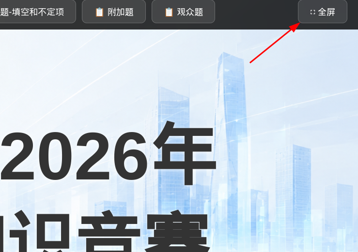
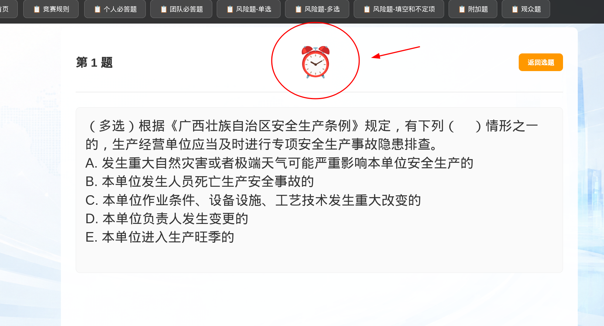
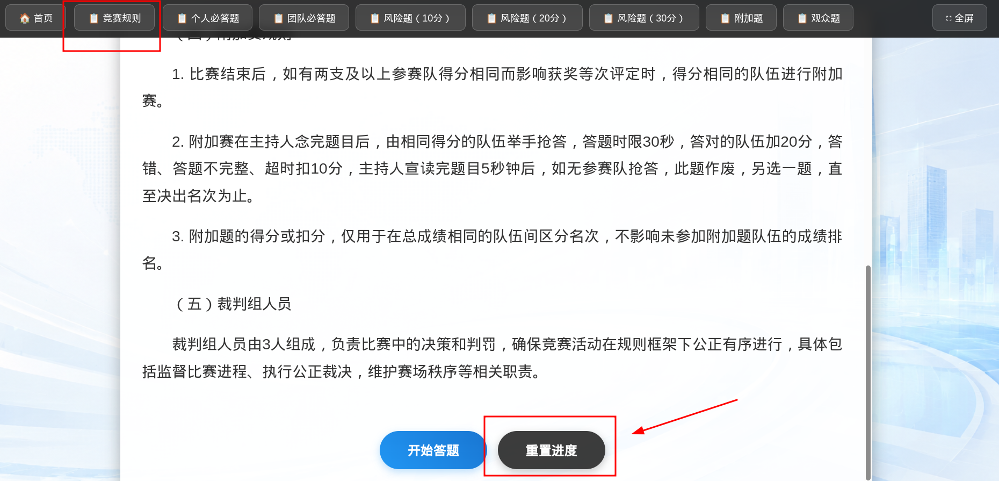
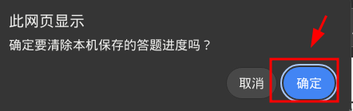

# 竞赛网页使用说明书

## 一、打开网页的方式

优先使用以下浏览器，兼容性较好，适合现场投屏和全屏展示：

- Chrome
- Edge

推荐的屏幕分辨率：

- 1920x1080

任选一种方式打开：

1. 进入 `static-quiz-ppt` 文件夹，双击打开 `index.html`。
2. 打开 Chrome 或 Edge，把 `index.html` 文件拖到浏览器窗口里。

## 二、基本操作流程

1. 打开网页后，鼠标移动到首页上方，出现导航栏，然后单击“全屏”

   

2. 如果文字、按钮大小不合适，可以临时调整大小，方法是：按住 `Ctrl`，再滚动鼠标滚轮

3. 点击首页的任意处，进入「竞赛规则」页。

4. 阅读规则后，点击上方导航栏中的任一答题栏目，开始答题。

5. 点击题号，进入对应题目页。

6. 选手开始读题，请手动点击闹钟开始倒计时。

   

7. 选手答题结束后，点击「显示答案」。

8. 显示答案后，该题会被标记为已答

9. 点击「返回选题」，回到当前栏目选题页。

10. 继续选择下一道题。

## 三、重置答题进度功能

竞赛网页有进度存储功能，不管重启浏览器，还是刷新页面、关闭标签页，答题进度都不会丢失。

如果需要恢复到最初还未开始答题的状态，请进入「竞赛规则」，滑动到最底部，点击「重置进度」按钮，并在弹出的消息框中点击「确定」。

